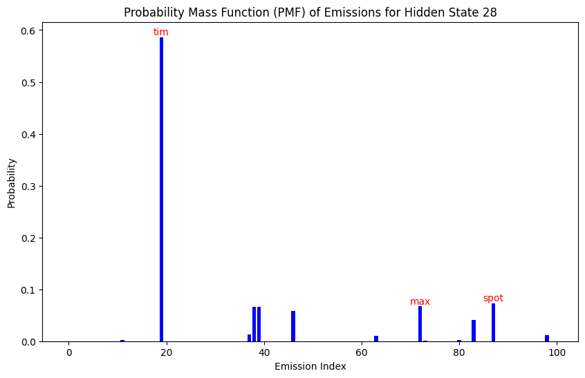

Goal: train a HMM to speak TinyStories

This is a fresh new copy, taking the advantage of switching the storage to `/n/netscratch`.

The working folder is now `/n/netscratch/sham_lab/Everyone/jchooi/in-context-language-learning`.

This document follows the plan below.
1. Download the TinyStories dataset.
2. Process it so that it only has lower case alphabets, space, commas and periods.
3. Create a dataset using the sentences that only uses the most frequent 500 words.
4. Tokenize and train-test split it.
5. Fit a range of HMMs on the dataset. Record their training and testing loss over time. Manually inspect the output after training.

## Downloading the TinyStories dataset

We looked at the TinyStories huggingface [website](https://huggingface.co/datasets/roneneldan/TinyStories). It mentions a file `TinyStoriesV2-GPT4-train.txt` that is generated by GPT-4. We downloaded it from this [link](https://huggingface.co/datasets/roneneldan/TinyStories/resolve/main/TinyStoriesV2-GPT4-train.txt?download=true) which has size 2.23 GB.

The file is downloaded to `/n/netscratch/sham_lab/Everyone/jchooi/in-context-language-learning/data/TinyStoriesV2-GPT4-train.txt` by calling `wget`.

You can preview the file with `head -n 50 TinyStoriesV2-GPT4-train.txt`.

## Processing the TinyStories dataset

The TinyStories data is a text file where stories are separated by `<|endoftext|>`. We will remove this since we only care about sentence structure. We process it at `process_tinystories.ipynb`.

We removed all lines that contain characters that are not alphabets or periods or commas or spaces. That includes quotations marks, exclamation marks and numbers.

The resulting file has one sentence on each line. Each sentence ends with the period. Each sentence contains only lowercase alphabets, periods or commas or spaces. Periods and commas are separated from other characters with a space.

Note that the story structure is disrupted because we removed entire lines that include non-accepted characters.

## Subsetting the TinyStories dataset

We rank each word in the processed dataset by frequency. We then plot how much sentences we have if we only allow ourselves to a certain number of words. We do this at `frequent_words.ipynb`.


We created datasets that use the top 100, 200, 300, 400, 500 words respectively.

Number of sentences
['1,069,319', '2,836,385', '4,338,458', '5,648,819', '6,783,857']

Unique sentences
['87,200', '517,265', '1,118,802', '1,758,064', '2,384,789']

Duplication rates
[94.74, 86.51, 79.88, 75.0, 71.21]

CHECK WITH ERAN: are the high duplication rates okay?
ANS: Use unique sentences

## Tokenizing the datasets

We tokenize each word in the datasets into its own integer, which is the rank (breaking frequency ties alphabetically). We also create the train-test split for each dataset. This is done in `tokenize_tinystories.ipynb`.

In the train-test split process, we randomly pulled out sentences into either train or test, so the story structure is further disrupted.

Number of training tokens (unique sentences)
['689,997', '4,360,726', '9,625,369', '15,352,822', '20,938,503']

Number of test tokens (unique sentences)
['171,600', '1,089,234', '2,404,845', '3,837,880', '5,238,512']


Number of training tokens
['7,451,413', '20,608,430', '31,785,933', '42,779,104', '51,522,412']

Number of test tokens
['2,128,850', '4,694,522', '7,513,301', '9,463,947', '11,918,012']

## Fitting the HMM

Before traininig all HMM models, we will experiment with the smaller 100-word model. 100-word means that the model has an emission dimension of 100. We will experiment with hidden state dimensions of 100, 200, 400, 800, 1600. We will experiment with context windows 100, 200, 400, 800, 1600. The results will then be tabulated.

This is done in `train_hmm_explore_100.ipynb`.

CHECK WITH ERAN: is there value to track loss over time?
ANS: try with smaller ones, if fast then no need track. Can also integrate with wandb.

Output noticed at 58m (output could have occured earlier)
1 -34269810.72588260             +nan

169m
2 -26602153.78323489 +7667656.94264771

176
3 -20925675.45272173 +5676478.33051316

245m
4 -17038641.70104500 +3887033.75167673

300m
5 -15268121.40285418 +1770520.29819082

359m
6 -14200245.55880919 +1067875.84404499


It seems that the model goes through one iteration every 60 minutes. The columns mean: iteration number, log-likelihood, and change in log-likelihood.

Now, I will check the output from `train_hmm_explore_100.sh`, which is `hmm-L-100-h-100-e-100.pkl`, a model with 100 emission states, 100 hidden states and 100 context length.

To analyze a HMM, I am thinking of looking at its stationary distribution, which is unique for an irreducible chain. I expect the hidden states to form an irreducible chain since the graph should be complete (there is a positive probability from any state to any state). Then I can look at each hidden state and get its emission probabilities too. I can first try to visualize the emission probability distribution for each of the top 10 hidden states by stationary distribution probability.

I visualize this with `eval_hmm_100.ipynb`.

TELL
The HMM is a success, noting that there is a hidden state that correspond to names.



Show the other plots, and note the lack of polysemanticity (a single high probability emission). Does this imply we should increase the number of possible emissions in our training data, and that our number of hidden dimensions is good enough?

ANS: can try decreasing the number of hidden states, and increasing the number of emissions, see if get anything better. Next step: use this to generate data to train LLM. Randomize over emission. Choose a permutation of emission. Destroy the information from the emission. (2) Generate a random distribution.

Now we will let the HMM generate its own output.

The HMM successfully outputs recognizable text
```
once upon a time , there was a little boy named tim . they was up tree wanted happy . one day , little . to the park . she loved it too .
```

TELL
This uses train data that includes duplicates.

ANS: should be fine as long not too deterministic

We will now train a HMM with more hidden states. We do this at `train_hmm_vary_h_100.py`. We first set the `n_iter=1` to get the amount of time for one iteration, and we will then allocate sufficient time to do `n_iter=10`.

Separately, I increase the number of emissions to 200 and test the time taken for `n_iter=1` for `h=100,200,400,600,800`. This is at `train_hmm_vary_e_200.sh` and `train_hmm_vary_e_200.py`

TELL
CPU-only. Is there any way to use GPU to speed up the EM algorithm?

ANS: Can possibly speed something up. Use library if exists, but no need to implement the EM algorithm in GPU (a lot of time). Brown clusters check library.

RECAP
Our research question is that if we feed a LLM synthetic data generated by a HMM, will the LLM outperform the HMM?
- Year-end review: Do you think if we should continue pursuing this research question?
- If so, how big should the HMM be? Or what metrics should we judge the HMM so that we know we can train the LLM on it now.

ANS: can try training LLM.

Eran's schedule can be busier in the next couple of months. Ideally have something to submit in the coming months.

Start writing stuff up with Johnathan.

2 SLURM array jobs are done.

I will begin by checking the logs `train-hmm-vary-100-*` and `train-hmm-vary-e-200-*`.

All the `train-hmm-vary-100-*` was shut down except the first one with index 0. Here is its output

```
1 -34309313.13992910             +nan
Time taken: 14148.878897428513
```

This was in seconds, so roughly 3.9 hours.

The rest was cancelled at `2024-12-20T17:31:50`

For `train-hmm-vary-e-200-*`, we have the same situtation. All was shut down except the first one with the output

```
1 -108862257.88152701             +nan
Time taken: 9959.718718767166
```

This was roughly 2.8 hours.

The `train-hmm-vary-100-*` was to get the timing for one iteration of the model with hidden state size as hs = [200, 400, 600, 800]. Emission was fixed at 100. Context length was fixed at 100.


The `train-hmm-vary-e-200-*` was to do the same thing but the emission is instead fixed at 200. Context length was again fixed at 100. Hidden sizes are varied at [100, 200, 400, 600, 800].

For more comparison, `train_hmm_explore_100` gave a runtime of 1 hours per iter, with model specs L=100, e=100, h=100. It seems like doubling the e will triple the runtime, while doubling the h will quadruple it.

Back of the envelope calculations show that `train-hmm-vary-100-*` with h=200 will require 39 hours, while `train-hmm-vary-e-200-*` with h=100 will require 28 hours.

I will try to see if there are ways to speed this up. First I will look at the documentation.

One option is to use a different package called [pomegranate](https://github.com/jmschrei/pomegranate).

I will explore using the library at `train_hmm_e_100_h_100_L_100_pomegranate.ipynb`.

The [tutorial](https://github.com/jmschrei/pomegranate/blob/master/docs/tutorials/C_Feature_Tutorial_1_GPU_Usage.ipynb) at pomegranate suggests that there will be huge savings by fitting the HMM on a GPU.

I will now read the [HMM tutorial](https://github.com/jmschrei/pomegranate/blob/master/docs/tutorials/B_Model_Tutorial_4_Hidden_Markov_Models.ipynb).

I test whether the current setup allows GPU usage from-the-shelf at [test_pomegranate_gpu.ipynb](test_pomegranate_gpu.ipynb). The results show that we do support GPU usage off the shelf. It seems like using GPU is 4x faster per loop for the dense HMM. If the hmmlearn package runs using the roughly equal time as the pomegranate in CPU, we would expect that (h=200,e=100,L=100) to take 10 hours while (h=100,e=200,L=100) to take 7 hours. This is very reasonable.

Currently I am stuck at `train_hmm_e_100_h_100_L_100_pomegranate.ipynb` to get a non-nan training improvemenet.

After some tinkering, it seems to suggest that we should provide some initializaiton.

After some checking and experimenting, I think initialization is okay.

It could be the data input format instead.

I don't see an error with that too.

To make sure I understand the pomegranate library, I will now create a toy notebook to check if I can fit a simple HMM, this is at `toy_pomegranate.ipynb`.