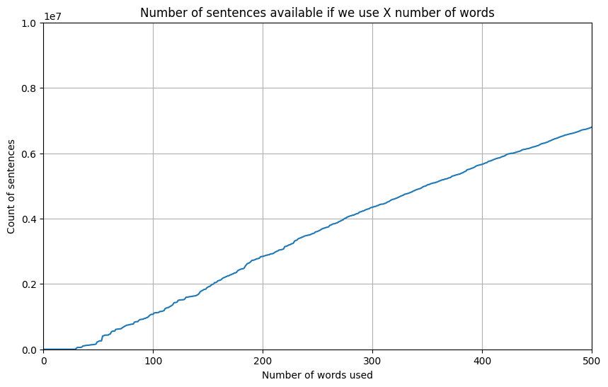

Goal: train a HMM to speak TinyStories

This is a fresh new copy, taking the advantage of switching the storage to `/n/netscratch`.

The working folder is now `/n/netscratch/sham_lab/Everyone/jchooi/in-context-language-learning`.

This document follows the plan below.
1. Download the TinyStories dataset.
2. Process it so that it only has lower case alphabets, space, commas and periods.
3. Create a dataset using the sentences that only uses the most frequent 500 words.
4. Tokenize and train-test split it.
5. Fit a range of HMMs on the dataset. Record their training and testing loss over time. Manually inspect the output after training.

## Downloading the TinyStories dataset

We looked at the TinyStories huggingface [website](https://huggingface.co/datasets/roneneldan/TinyStories). It mentions a file `TinyStoriesV2-GPT4-train.txt` that is generated by GPT-4. We downloaded it from this [link](https://huggingface.co/datasets/roneneldan/TinyStories/resolve/main/TinyStoriesV2-GPT4-train.txt?download=true) which has size 2.23 GB.

The file is downloaded to `/n/netscratch/sham_lab/Everyone/jchooi/in-context-language-learning/data/TinyStoriesV2-GPT4-train.txt` by calling `wget`.

You can preview the file with `head -n 50 TinyStoriesV2-GPT4-train.txt`.

## Processing the TinyStories dataset

The TinyStories data is a text file where stories are separated by `<|endoftext|>`. We will remove this since we only care about sentence structure. We process it at `process_tinystories.ipynb`.

We removed all lines that contain characters that are not alphabets or periods or commas or spaces. That includes quotations marks, exclamation marks and numbers.

The resulting file has one sentence on each line. Each sentence ends with the period. Each sentence contains only lowercase alphabets, periods or commas or spaces. Periods and commas are separated from other characters with a space.

Note that the story structure is disrupted because we removed entire lines that include non-accepted characters.

## Subsetting the TinyStories dataset

We rank each word in the processed dataset by frequency. We then plot how much sentences we have if we only allow ourselves to a certain number of words. We do this at `frequent_words.ipynb`.

We created datasets that use the top 100, 200, 300, 400, 500 words respectively.

Number of sentences
['1,069,319', '2,836,385', '4,338,458', '5,648,819', '6,783,857']

Duplication rates
[94.74, 86.51, 79.88, 75.0, 71.21]

TOCHECK WITH ERAN: are the high duplication rates okay?

## Tokenizing the datasets

We tokenize each word in the datasets into its own integer, which is the rank (breaking frequency ties alphabetically). We also create the train-test split for each dataset. This is done in `tokenize_tinystories.ipynb`.

In the train-test split process, we randomly pulled out sentences into either train or test, so the story structure is further disrupted.

Here are the number of tokens for each training dataset.
['7,665,100', '20,251,971', '31,452,782', '41,800,752', '50,757,853']

Number of test tokens
['1,915,163', '5,050,981', '7,846,452', '10,442,299', '12,682,571']

## Fitting the HMM

Before traininig all HMM models, we will experiment with the smaller 100-word model. 100-word means that the model has a emission dimension of 100. We will experiment with hidden state dimensions of 100, 200, 400, 800, 1600. We will experiment with context windows 100, 200, 400, 800, 1600. The results will then be tabulated.

This is done in `train_hmm_explore_100.ipynb`.

TOCHECK WITH ERAN: is there value to track loss over time?